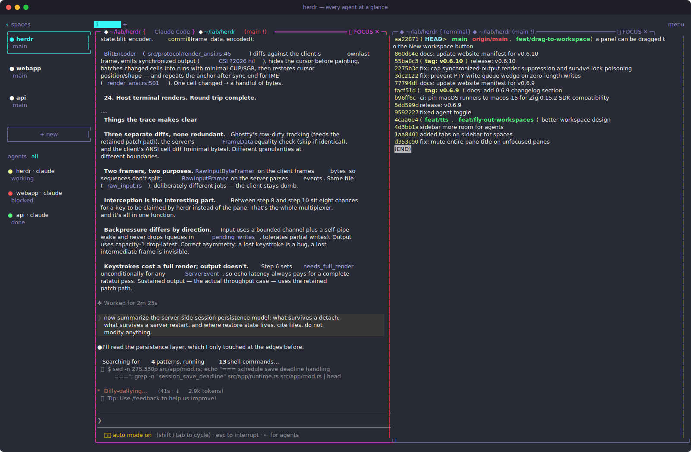
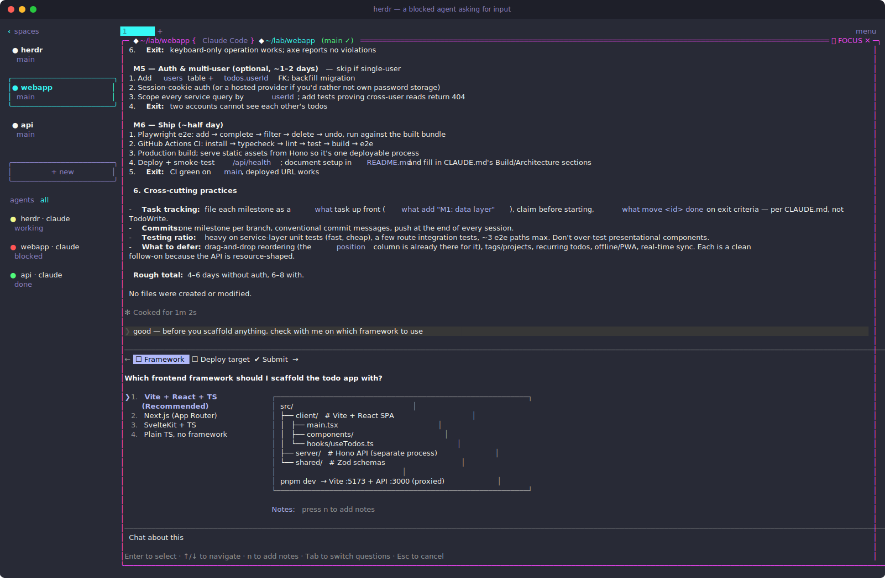
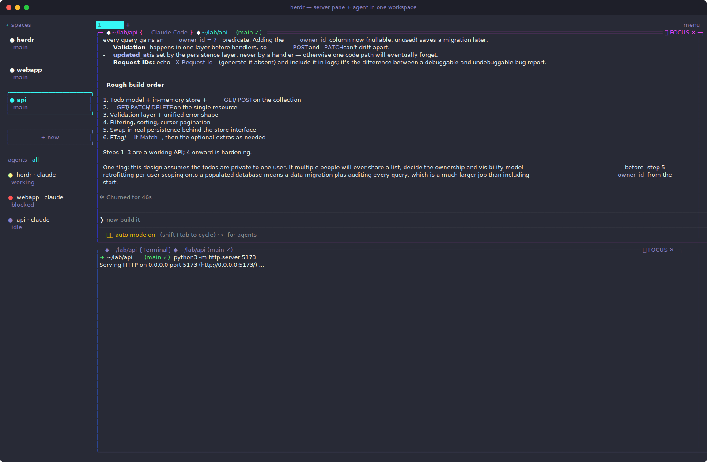

# herdr

<p align="center">
  
</p>

<p align="center">
  <a href="#install">install</a> · <a href="#quick-start">quick start</a> · <a href="#supported-agents">supported agents</a> · <a href="website/src/content/docs/integrations.mdx">integrations</a> · <a href="website/src/content/docs/configuration.mdx">configuration</a> · <a href="website/src/content/docs/socket-api.mdx">socket api</a> · <a href="#documentation">all docs</a>
</p>

---

**agent multiplexer that lives in your terminal.**

workspaces, tabs, panes. mouse-native: click, drag, split. every agent at a glance: blocked, working, done. detach and reattach, agents keep running. no gui app, no electron, no mac-only native wrapper. you see the agent's own terminal, not someone's interpretation of it.

this is the **motionharvest fork** of [ogulcancelik/herdr](https://github.com/ogulcancelik/herdr), with its own sidebar redesign and workspace interactions on top of upstream.



*a real session: the `herdr` workspace with claude working next to a terminal pane, while the sidebar tracks a blocked agent in `webapp` and a finished one in `api`.*

## what's different in this fork

- **sidebar tabs for spaces** — the sidebar got a `spaces` tab layout, making it faster to switch between workspaces
- **redesigned workspace cards** — more room in the sidebar for the agent list
- **drag a panel to the New workspace button** — drag any pane onto `+ new` in the sidebar to fly it out into its own workspace
- **fixed agent toggle** — the `agents all` toggle in the sidebar works reliably
- **calmer pane titles** — the entire pane title is muted on unfocused panes, and the agent label color stays distinct even when git info is shown
- **fork install script** — `install.sh` installs from this fork's GitHub releases

see the [changelog](CHANGELOG.md) for the full history.

## install

```bash
curl -fsSL https://raw.githubusercontent.com/motionharvest/herdr/main/install.sh | bash
```

Until this fork publishes its own GitHub release, install the upstream binary with:

```bash
HERDR_REPO=ogulcancelik/herdr curl -fsSL https://raw.githubusercontent.com/motionharvest/herdr/main/install.sh | bash
```

or build this fork from source (recommended if you want the fork features above):

```bash
git clone https://github.com/motionharvest/herdr
cd herdr
cargo build --release
./target/release/herdr
```

requires linux or macos. full install, update, Homebrew, mise, and Nix details live in the [install docs](website/src/content/docs/install.mdx).

## quick start

Start Herdr in the directory where the work lives:

```bash
herdr
```

Herdr starts or attaches to one background session server. Press `ctrl+b`, then `shift+n` to create a workspace. Run an agent in the root pane. Press `ctrl+b`, then `v` or `minus` to split panes, `ctrl+b`, then `c` to create a tab, and `ctrl+b`, then `w` to switch workspaces.

Press `ctrl+b q` to detach the client. The server and pane processes keep running. Open another terminal and run `herdr` again to reattach.

More in the [quick start docs](website/src/content/docs/quick-start.mdx).

## core concepts

**Server and client.** By default, `herdr` attaches to a background server. Detaching closes only the client. `herdr server stop` stops the default server and kills its panes. Named sessions are separate server namespaces: use `herdr session attach work`, `herdr session stop work`, and `herdr session list` when you want fully separate runtime state.

**Workspaces, tabs, panes.** A workspace is the project-level container. Tabs group panes inside a workspace. Panes are real terminal processes, not rewritten agent views.

**Copy.** Herdr copies pane text, not the sidebar. Drag-select inside a pane, double-click a word or token, or press `prefix+[` for keyboard copy mode. In copy mode, move with `h/j/k/l`, `w/b/e`, and `{`/`}`, start selection with `v` or Space, copy with `y` or Enter, and leave with `q` or Esc. In PuTTY and some SSH terminals, hold `Shift` while dragging to use the terminal's own selection, and `Shift` + right click to paste.

**Update and restore.** `herdr update` installs a new binary, but a running server keeps using the old process until it is stopped or handed off. Stop the old server to use the new version. Stopping exits pane processes. Run `herdr server stop`, then run `herdr` again for the default session. For a named session, run `herdr session stop <name>`, then run `herdr session attach <name>` again. `herdr update --handoff` is experimental and tries to move live panes, including foreground processes such as dev servers, from the old server to the new one. With current official integrations installed, supported agent panes can restart from their native agent sessions after a server restart or update.

**Keybindings.** Herdr uses explicit keybinding strings. `prefix+n` means press the configured prefix, then `n`. `ctrl+alt+n`, `cmd+k`, `alt+1`, and function-key chords are direct terminal-mode shortcuts and do not need the prefix. Plain direct printable keys such as `n` steal normal typing, so use `prefix+n` unless you intentionally want a modifier-gated direct binding.

**Agent awareness.** The sidebar shows blocked, working, done, and idle states. Detection works with process names and terminal output by default. Official integrations can add native session identity for restore, semantic state reports, or both.

The full concept reference lives in [concepts](website/src/content/docs/concepts.mdx) and [how to work with Herdr](website/src/content/docs/how-to-work.mdx).

## agent awareness

the sidebar shows which agents are blocked, working, or done. workspaces roll up to their most urgent state so you can scan the full list at a glance.

states:

- 🔴 **blocked** — agent needs input or approval
- 🟡 **working** — agent is actively running
- 🔵 **done** — work finished, you have not looked at it yet
- 🟢 **idle** — done and seen



*the `webapp` agent hit a question and went red in the sidebar. the `herdr` agent keeps working in the background.*

detection works by reading foreground process and terminal output. zero config, no hooks required. official claude code, codex, and opencode integrations provide session restore identity; pi, omp, github copilot cli, hermes, qodercli, and custom socket integrations can report their own state. details in the [agents docs](website/src/content/docs/agents.mdx).

## how it compares

|                          | tmux | gui managers | herdr |
|--------------------------|------|--------------|-------|
| persistent sessions       | ✓    | —            | ✓     |
| detach / reattach        | ✓    | —            | ✓     |
| panes, tabs, workspaces  | ✓    | ✓            | ✓     |
| agent awareness          | —    | ✓            | ✓     |
| lives in your terminal   | ✓    | —            | ✓     |
| real terminal views      | ✓    | —            | ✓     |
| mouse-native            | —    | ✓            | ✓     |
| lightweight binary       | ✓    | —            | ✓     |
| agents can orchestrate   | ?    | ?            | ✓     |

tmux gives you persistence and panes, but it was built before agents existed. gui managers show agent state, but they make you leave your terminal and use their wrapped view. herdr is persistence and awareness in one tool that stays out of your way.

## update

Herdr notifies you when a new version is available. Run manually:

```bash
herdr update
```

`herdr update` is for installs managed by Herdr's own installer. Homebrew, mise, and Nix installs update through their package managers, then use the same stop-and-run-again flow if a session is still running the old server. Direct installs can opt into development preview builds with `herdr channel set preview` and return to stable with `herdr channel set stable`. See the [install docs](website/src/content/docs/install.mdx) and [session state docs](website/src/content/docs/session-state.mdx) for the full update, restart, restore, and handoff matrix.

## remote and attach

Herdr works over normal SSH. Run it on the remote host, detach, and reattach later:

```
ssh you@yourserver
herdr
```

You can also attach from your local terminal without opening a shell first:

```bash
herdr --remote workbox
herdr --remote ssh://you@yourserver:2222
```

Remote attach adds fallback SSH keepalives by default while preserving your own SSH config. Set `[remote].manage_ssh_config = false` to use plain `ssh`.

Direct attach connects your current terminal to one server-owned terminal:

```bash
herdr agent attach <target>
herdr terminal attach <terminal_id>
```

See the [persistence and remote docs](website/src/content/docs/persistence-remote.mdx) for remote keybinding, named-session, and handoff details.

## lives in your terminal

not a gui window, not a web dashboard, not electron. herdr runs inside whatever terminal you already use. single rust binary, no dependencies. works inside tmux as the outer terminal environment.

## what you get

- **workspaces** — organized around git repos or folder names, each with its own tabs and panes
- **tabs** — first-class in the socket api and cli
- **copy-friendly** — drag-select pane text, double-click tokens, or use keyboard copy mode with `prefix+[`, `h/j/k/l`, `{`/`}`, `v`, and `y`
- **notifications** — sounds and toasts for background events; tab-aware suppression
- **18 built-in themes** — catppuccin, terminal, tokyo night, gruvbox, one, solarized, kanagawa, rosé pine, vesper, and light variants for the main palettes
- **session persistence** — pane processes survive client detach; sessions restore panes after full restart, with opt-in recent screen history

## agents can use herdr too

The local Unix socket lets agents create workspaces, split panes, spawn helpers, read output, and wait for state changes. Every screenshot in this README was staged and captured by an agent running inside herdr, driving the socket API against a nested session.



*one workspace, two panes: an agent on top, the dev server it should talk to below — both real terminals.*

Start with the [socket API docs](website/src/content/docs/socket-api.mdx) and [`SKILL.md`](./SKILL.md).

## supported agents

automatic detection works out of the box. process name matching plus terminal output heuristics.

| agent | idle / done | working | blocked |
|-------|-------------|---------|---------|
| [pi](https://pi.dev) | ✓ | ✓ | partial |
| [claude code](https://docs.anthropic.com/en/docs/claude-code) | ✓ | ✓ | ✓ |
| [codex](https://github.com/openai/codex) | ✓ | ✓ | ✓ |
| [droid](https://factory.ai) | ✓ | ✓ | ✓ |
| [amp](https://ampcode.com) | ✓ | ✓ | ✓ |
| [opencode](https://github.com/anomalyco/opencode) | ✓ | ✓ | ✓ |
| [grok cli](https://x.ai/grok) | ✓ | ✓ | ✓ |
| [hermes agent](https://github.com/NousResearch/hermes-agent) | ✓ | ✓ | ✓ |
| [kilo code cli](https://kilo.ai/) | ✓ | ✓ | ✓ |
| cursor agent | ✓ | ✓ | ✓ |
| antigravity cli | ✓ | ✓ | ✓ |
| kimi code cli | ✓ | ✓ | ✓ |
| [github copilot cli](https://github.com/features/copilot) | ✓ | ✓ | ✓ |
| [qodercli](https://qoder.com/cli) | ✓ | ✓ | ✓ |
| [kiro cli](https://kiro.dev/docs/cli/) | ✓ | ✓ | — |

detected but not fully tested: gemini cli, cline.

for agents outside the built-in list, herdr still works as a terminal multiplexer with workspaces, panes, and tiling. custom integrations can report agent labels over the socket api. see the [socket api docs](website/src/content/docs/socket-api.mdx).

### direct integrations

official integrations have two roles. claude code, codex, and opencode report session identity for native restore, while their state still comes from screen detection. pi, github copilot cli, and hermes report both semantic state and session identity. omp and qodercli report semantic state without native session restore. install with:

```bash
herdr integration install pi
herdr integration install omp
herdr integration install claude
herdr integration install codex
herdr integration install copilot
herdr integration install opencode
herdr integration install hermes
herdr integration install qodercli
```

see the [integrations docs](website/src/content/docs/integrations.mdx) for setup details.

## keybindings

Press `ctrl+b` to enter prefix mode. Default actions are prefix-first and tmux-like:

| key | action |
|-----|--------|
| `prefix+c` | new tab |
| `prefix+n` / `prefix+p` | next / previous tab |
| `prefix+1..9` | switch tab |
| `prefix+w` | workspace navigation |
| `prefix+g` | session navigator |
| `prefix+shift+n` | new workspace |
| `prefix+shift+g` | new worktree |
| `prefix+shift+w` | rename workspace |
| `prefix+shift+d` | close workspace |
| `prefix+h/j/k/l` | focus pane |
| `prefix+v` / `prefix+minus` | split pane |
| `prefix+x` | close pane |
| `prefix+b` | toggle sidebar |
| `prefix+z` | zoom pane |
| `prefix+r` | resize mode |
| `prefix+q` | detach |

Some direct shortcuts work without the prefix:

| key | action |
|-----|--------|
| `ctrl+left/right/up/down` | focus the pane in that direction |
| `ctrl+alt+left/right/up/down` | split — add a new pane in that direction |

Mouse is supported throughout — including dragging a pane onto the sidebar's `+ new` button to move it into its own workspace. Resize mode uses `h`/`l` for width, `j`/`k` for height, and `esc` to exit. Full syntax, optional actions, indexed bindings, and custom command bindings live in the [configuration docs](website/src/content/docs/configuration.mdx).

## configuration

config file: `~/.config/herdr/config.toml`

```bash
herdr --default-config   # print full default config
```

In-app settings cover theme, sound, and toast preferences. Herdr writes logs under `~/.config/herdr/`; in persistent session mode, `herdr-client.log` and `herdr-server.log` are usually the useful files. Full configuration and logging details live in the [configuration docs](website/src/content/docs/configuration.mdx).

## documentation

All documentation ships in this repository under [`website/src/content/docs/`](website/src/content/docs/):

- [documentation index](website/src/content/docs/index.mdx) — starting point for all docs
- [quick start](website/src/content/docs/quick-start.mdx) — first session, panes, copy, and named sessions
- [install](website/src/content/docs/install.mdx) — install, update, Homebrew, mise, and Nix
- [concepts](website/src/content/docs/concepts.mdx) — server/client, workspaces, tabs, panes
- [how to work with Herdr](website/src/content/docs/how-to-work.mdx) — day-to-day workflow patterns
- [agents](website/src/content/docs/agents.mdx) — agent detection and status states
- [session state and restore](website/src/content/docs/session-state.mdx) — detach, restart restore, agent restore, and live handoff
- [persistence and remote access](website/src/content/docs/persistence-remote.mdx) — SSH, remote attach, named sessions
- [configuration](website/src/content/docs/configuration.mdx) — keybindings, themes, notifications, environment variables
- [integrations](website/src/content/docs/integrations.mdx) — pi, omp, claude code, codex, github copilot cli, opencode, hermes, qodercli
- [socket API](website/src/content/docs/socket-api.mdx) — socket protocol and full CLI reference
- [CLI reference](website/src/content/docs/cli-reference.mdx) — every `herdr` subcommand
- [agent skill file](website/src/content/docs/agent-skill.mdx) and [`SKILL.md`](./SKILL.md) — reusable skill so agents can drive herdr from inside it
- [`CHANGELOG.md`](CHANGELOG.md) — release history, including this fork's changes

The docs site itself lives in [`website/`](website/) (Astro; see [its README](website/README.md) to build and deploy it).

## agent instructions

if you are an ai agent helping with this repository, read [`AGENTS.md`](./AGENTS.md) before making changes and read [`CONTRIBUTING.md`](./CONTRIBUTING.md) before opening issues or PRs.

## development

```bash
git clone https://github.com/motionharvest/herdr
cd herdr
cargo build --release
./target/release/herdr

just test        # unit tests
just check       # formatting, tests, and maintenance checks
```

## license

Herdr is dual-licensed:

1. Open source: GNU Affero General Public License v3.0 or later (AGPL-3.0-or-later).
2. Commercial: commercial licenses are available for organizations that cannot comply with AGPL.

This fork inherits its license from [upstream herdr](https://github.com/ogulcancelik/herdr) (contact: hey@herdr.dev).

## mandatory star history

<a href="https://www.star-history.com/?repos=motionharvest%2Fherdr&type=date&legend=top-left">
 <picture>
   <source media="(prefers-color-scheme: dark)" srcset="https://api.star-history.com/chart?repos=motionharvest/herdr&type=date&theme=dark&legend=top-left&v=2026-07-24" />
   <source media="(prefers-color-scheme: light)" srcset="https://api.star-history.com/chart?repos=motionharvest/herdr&type=date&legend=top-left&v=2026-07-24" />
   
 </picture>
</a>
